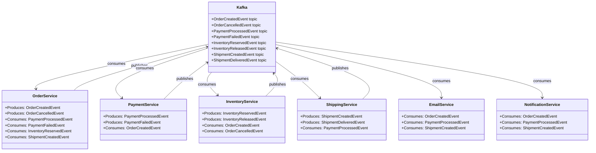
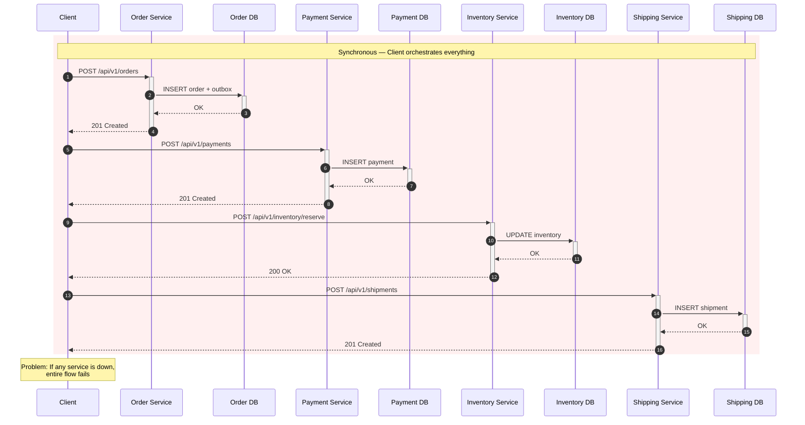
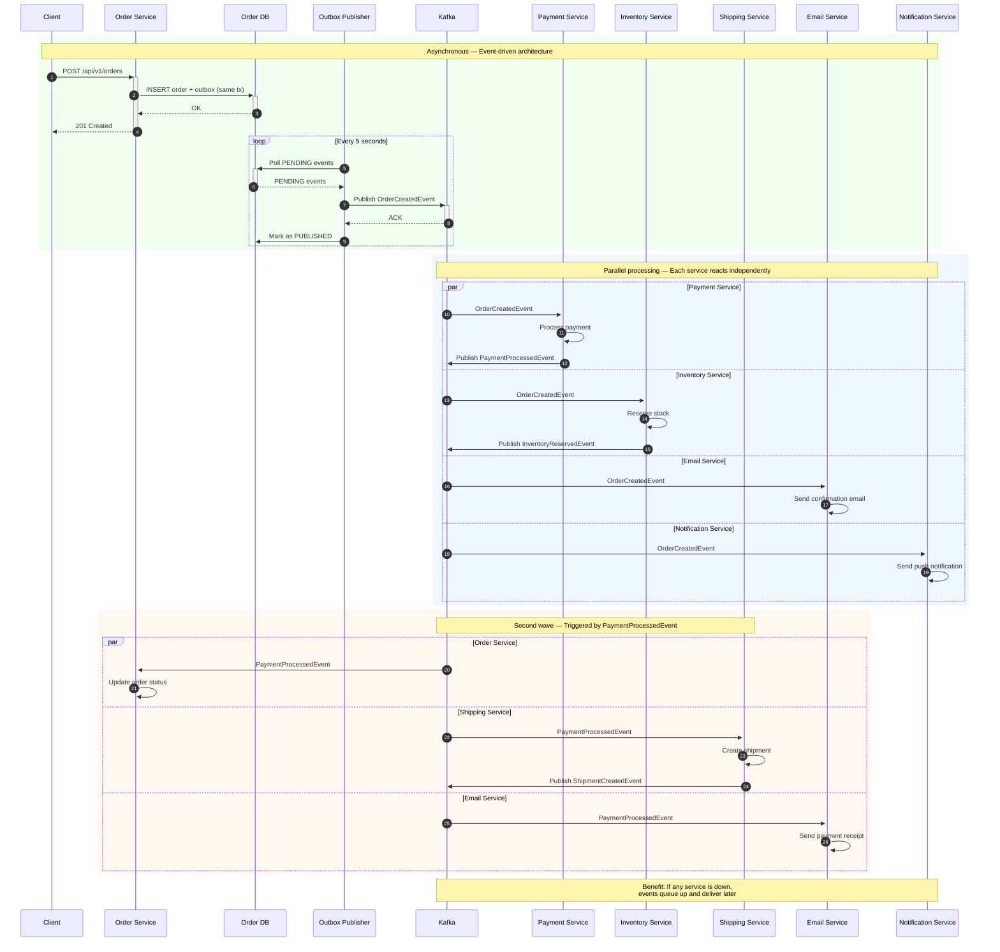
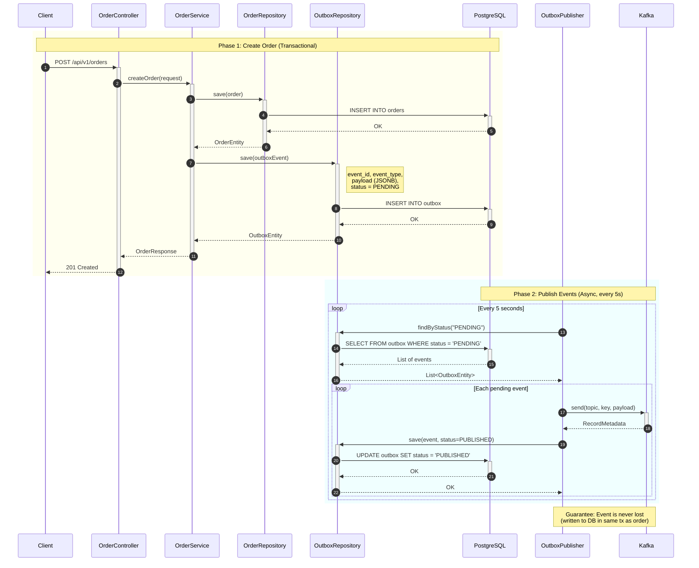

# EventFlow Commerce

A production-quality event-driven e-commerce backend built with Java 21, Spring Boot 3.4.4, and PostgreSQL. Designed using Domain-Driven Design (DDD) and Clean Architecture principles.

---

## Table of Contents

1. [Project Goal](#1-project-goal)
2. [Tech Stack](#2-tech-stack)
3. [Architecture](#3-architecture)
4. [Diagrams](#4-diagrams)
5. [Services & Ports](#5-services--ports)
6. [Databases](#6-databases)
7. [Docker Networking](#7-docker-networking)
8. [Data Flow](#8-data-flow)
9. [Domain Events](#9-domain-events)
10. [Project Structure](#10-project-structure)
11. [How to Build & Run](#11-how-to-build--run)
12. [API Endpoints](#12-api-endpoints)
13. [Database Design](#13-database-design)
14. [Key Design Decisions](#14-key-design-decisions)
15. [Testing](#15-testing)
16. [Kafka Integration](#16-kafka-integration)

---

## 1. Project Goal

Build a production-ready **event-driven e-commerce backend** with 6 independent microservices, each owning its own PostgreSQL database. Clean Architecture, Domain Driven Design, ready to plug in Kafka as the event backbone — currently running with direct REST calls and the **Transactional Outbox Pattern** already in place.

---

## 2. Tech Stack

| Technology | Version | Purpose |
|---|---|---|
| Java | 21 | Language |
| Spring Boot | 3.4.4 | Framework |
| Spring Data JPA | — | Database access |
| Spring Validation | — | Request validation |
| Flyway | — | Database migrations |
| MapStruct | 1.6.3 | POJO mapping |
| Lombok | — | Boilerplate reduction |
| PostgreSQL | 16 Alpine | Database per service |
| Docker Compose | — | Container orchestration |
| Testcontainers | 1.21.4 | Integration test databases |
| Maven | 3.x | Build tool |

---

## 3. Architecture

```
┌───────────────────────────────────────────────────────────────────────────┐
│                            CLIENT (Browser / curl / Postman)              │
└─────────────────────────────────┬─────────────────────────────────────────┘
                                  │ HTTP REST
                                  ▼
    ┌─────────────────────────────────────────────────────────────────┐
    │                    Docker Bridge Network: eventflow-net          │
    │                                                                  │
    │  ┌──────────────┐  ┌──────────────┐  ┌──────────────────────┐   │
    │  │ Order Service │  │Payment Service│  │  Inventory Service   │   │
    │  │ Port 8081     │  │Port 8082     │  │  Port 8083           │   │
    │  │ orderdb:5432  │  │paymentdb:5433│  │  inventorydb:5434    │   │
    │  └──────┬───────┘  └──────┬───────┘  └─────────┬────────────┘   │
    │         │                  │                     │                │
    │  ┌──────┴───────┐  ┌──────┴───────┐  ┌─────────┴────────────┐   │
    │  │ Postgres 16   │  │ Postgres 16   │  │ Postgres 16          │   │
    │  │ order-db:5432 │  │ payment-db   │  │ inventory-db:5434    │   │
    │  └──────────────┘  └──────────────┘  └──────────────────────┘   │
    │                                                                  │
    │  ┌──────────────┐  ┌──────────────┐  ┌──────────────────────┐   │
    │  │Shipping Service│  │ Email Service │  │ Notification Service │   │
    │  │ Port 8084     │  │ Port 8085     │  │  Port 8086           │   │
    │  │ shippingdb    │  │ emaildb       │  │  notificationdb     │   │
    │  └──────────────┘  └──────────────┘  └──────────────────────┘   │
    │                                                                  │
    └─────────────────────────────────────────────────────────────────┘
```

Each service follows **Clean Architecture** package separation:

```
service/
├── domain/          # Enums, business rules (no Spring dependencies)
├── entity/          # JPA entities
├── repository/      # Spring Data JPA repositories
├── dto/request/     # Request DTOs (with validation)
├── dto/response/    # Response DTOs
├── mapper/          # MapStruct mapper interfaces
├── service/         # Business logic (@Transactional)
├── controller/      # REST endpoints (@RestController)
└── resources/db/migration/   # Flyway SQL migrations
```

---

## 4. Diagrams

### 4.1 Class Diagram — Domain Entities

```mermaid
classDiagram
    direction TB

    class BaseEntity {
        <<abstract>>
        +UUID id
        +LocalDateTime createdAt
        +LocalDateTime updatedAt
        +Integer version
        +Boolean active
    }

    class OrderEntity {
        +String customerId
        +OrderStatus status
        +BigDecimal totalAmount
        +String currency
        +String shippingAddress
    }

    class OrderItemEntity {
        +String productId
        +String productName
        +Integer quantity
        +BigDecimal unitPrice
        +BigDecimal subtotal
    }

    class OutboxEntity {
        +String eventId
        +String aggregateId
        +String eventType
        +String payload
        +OutboxStatus status
    }

    class PaymentEntity {
        +String orderId
        +BigDecimal amount
        +String currency
        +PaymentStatus status
    }

    class TransactionEntity {
        +String paymentId
        +String transactionId
        +TransactionStatus status
        +BigDecimal amount
        +String gatewayResponse
    }

    class ProductEntity {
        +String name
        +String sku
        +String description
        +BigDecimal price
        +String currency
        +Boolean active
    }

    class InventoryEntity {
        +UUID productId
        +Integer quantityAvailable
        +Integer quantityReserved
    }

    class ReservationEntity {
        +String orderId
        +UUID productId
        +Integer quantity
        +ReservationStatus status
        +LocalDateTime expiresAt
    }

    class ShipmentEntity {
        +String orderId
        +String trackingNumber
        +String carrier
        +ShipmentStatus status
        +String shippingAddress
        +LocalDateTime estimatedDelivery
    }

    class TrackingEventEntity {
        +UUID shipmentId
        +String status
        +String location
        +String description
        +LocalDateTime timestamp
    }

    class EmailHistoryEntity {
        +String toAddress
        +String subject
        +String body
        +EmailStatus status
        +LocalDateTime sentAt
    }

    class ProcessedEventEntity {
        +String eventId
        +String eventType
        +LocalDateTime processedAt
    }

    class NotificationEntity {
        +String userId
        +String title
        +String message
        +NotificationType type
        +NotificationStatus status
        +LocalDateTime sentAt
    }

    BaseEntity <|-- OrderEntity
    BaseEntity <|-- OrderItemEntity
    BaseEntity <|-- OutboxEntity
    BaseEntity <|-- PaymentEntity
    BaseEntity <|-- TransactionEntity
    BaseEntity <|-- ProductEntity
    BaseEntity <|-- InventoryEntity
    BaseEntity <|-- ReservationEntity
    BaseEntity <|-- ShipmentEntity
    BaseEntity <|-- TrackingEventEntity
    BaseEntity <|-- EmailHistoryEntity
    BaseEntity <|-- ProcessedEventEntity
    BaseEntity <|-- NotificationEntity

    OrderEntity "1" *-- "0..*" OrderItemEntity : contains
    OrderEntity "1" -- "0..*" OutboxEntity : generates
    PaymentEntity "1" *-- "0..*" TransactionEntity : has
    ProductEntity "1" -- "1" InventoryEntity : has
    ShipmentEntity "1" *-- "0..*" TrackingEventEntity : tracks
```



### 4.2 Class Diagram — Service Communication (Current: REST)

```mermaid
classDiagram
    direction LR

    class Client {
        +HTTP requests
    }

    class OrderController {
        +POST /orders
        +GET /orders/{id}
        +DELETE /orders/{id}
    }

    class PaymentController {
        +POST /payments
        +GET /payments/{id}
    }

    class InventoryController {
        +POST /inventory/reserve
        +POST /products
    }

    class ShippingController {
        +POST /shipments
        +PUT /shipments/{id}/status
    }

    class EmailController {
        +POST /emails/send
    }

    class NotificationController {
        +POST /notifications/send
    }

    Client --> OrderController : HTTP
    Client --> PaymentController : HTTP
    Client --> InventoryController : HTTP
    Client --> ShippingController : HTTP
    Client --> EmailController : HTTP
    Client --> NotificationController : HTTP

    OrderController --> OrderService
    PaymentController --> PaymentService
    InventoryController --> InventoryService
    ShippingController --> ShippingService
    EmailController --> EmailService
    NotificationController --> NotificationService
```

### 4.3 Class Diagram — Service Communication (After: Kafka)



### 4.4 Sequence Diagram — Current Flow (Synchronous REST)



### 4.5 Sequence Diagram — After Kafka Integration (Asynchronous)



### 4.6 Sequence Diagram — Order Service Outbox Pattern (Detail)



---

## 5. Services & Ports

| # | Service | Port | Docker Service Name | REST API Prefix |
|---|---|---|---|---|
| 1 | Order Service | 8081 | `order-service` | `/api/v1/orders` |
| 2 | Payment Service | 8082 | `payment-service` | `/api/v1/payments` |
| 3 | Inventory Service | 8083 | `inventory-service` | `/api/v1/products`, `/api/v1/inventory` |
| 4 | Shipping Service | 8084 | `shipping-service` | `/api/v1/shipments` |
| 5 | Notification Service | 8085 | `notification-service` | `/api/v1/notifications` |

---

## 6. Databases

Each microservice owns its **own PostgreSQL 16 database** — never shared.

| DB Container | Host Port | DB Name | User | Persistent Volume |
|---|---|---|---|---|
| `eventflow-order-db` | 5432 | `orderdb` | `order_user` | `order-db-data` |
| `eventflow-payment-db` | 5433 | `paymentdb` | `payment_user` | `payment-db-data` |
| `eventflow-inventory-db` | 5434 | `inventorydb` | `inventory_user` | `inventory-db-data` |
| `eventflow-shipping-db` | 5435 | `shippingdb` | `shipping_user` | `shipping-db-data` |
| `eventflow-email-db` | 5436 | `emaildb` | `email_user` | `email-db-data` |
| `eventflow-notification-db` | 5437 | `notificationdb` | `notification_user` | `notification-db-data` |

All core services share the `eventflow` database on Neon PostgreSQL. The notification-service uses tables `notification` and `notification_recipient` in the same database.
```

---

## 7. Docker Networking

### Why a bridge network?

Containers on the same bridge network can resolve each other by **service name** (DNS). Without it, inter-container communication would need hardcoded IPs.

### How it works here

All containers (6 Postgres + 6 services) are attached to a single bridge network:

```yaml
networks:
  eventflow-net:
    driver: bridge
```

Each service is created with `networks: - eventflow-net`. Docker's built-in DNS resolves the Compose service name to the container IP inside this network.

### Two Spring profiles for connectivity

**Local development** (`application.yml` — no Docker, services run on host):
```yaml
spring.datasource.url: jdbc:postgresql://localhost:5432/orderdb
```

**Docker deployment** (`application-docker.yml` — everything in containers):
```yaml
spring.datasource.url: jdbc:postgresql://order-db:5432/orderdb
```

Each Dockerfile runs with the `docker` profile:
```dockerfile
ENTRYPOINT ["java", "-jar", "app.jar", "--spring.profiles.active=docker"]
```

---

## 8. Data Flow

### Current Flow (Synchronous REST)

```
Client ──POST /orders──► Order Service
  └── saves order + outbox event to orderdb

Client ──POST /payments──► Payment Service
  └── processes payment, saves to paymentdb

Client ──POST /inventory/reserve──► Inventory Service
  └── reserves stock, saves to inventorydb

Client ──POST /shipments──► Shipping Service
  └── creates shipment, saves to shippingdb
```

**Problem**: Client orchestrates everything. If one service is down, the whole flow breaks.

### Target Flow (Event-Driven with Kafka)

```
Client ──POST /orders──► Order Service
  └── saves order + outbox event (OrderCreatedEvent) to orderdb
  └── OutboxPublisher polls outbox table, publishes to Kafka

Kafka Topic: OrderCreatedEvent
  ├──► Inventory Service: reserves stock
  ├──► Payment Service: processes payment
  ├──► Email Service: sends confirmation email
  └──► Notification Service: sends push notification

Kafka Topic: PaymentProcessedEvent (published by Payment Service)
  ├──► Order Service: updates order status
  ├──► Shipping Service: creates shipment
  ├──► Email Service: sends payment receipt
  └──► Notification Service: sends payment notification
```

**Benefit**: Each service reacts independently. If one is down, events queue up and deliver when it recovers.

---

## 9. Domain Events

All event classes are in `eventflow-common/src/main/java/com/eventflow/common/events/`. They are **POJOs** ready to be serialized to JSON and published to Kafka.

| Event Class | Triggered By | Consumed By |
|---|---|---|
| `OrderCreatedEvent` | Order placed | Inventory, Payment, Email, Notification |
| `OrderCancelledEvent` | Order cancelled | Inventory, Payment, Shipping |
| `PaymentProcessedEvent` | Payment succeeded | Order, Email, Notification |
| `PaymentFailedEvent` | Payment failed | Order, Email |
| `PaymentRefundedEvent` | Payment refunded | Order, Notification |
| `InventoryReservedEvent` | Stock reserved | Order, Shipping |
| `InventoryReleasedEvent` | Stock released | Order |
| `InventoryShortageEvent` | Insufficient stock | Order |
| `ShipmentCreatedEvent` | Shipment created | Order, Email, Notification |
| `ShipmentDeliveredEvent` | Shipment delivered | Order, Email |
| `ShipmentStatusChangedEvent` | Tracking updated | Order, Notification |

---

## 10. Project Structure

```
eventflow-commerce/
├── pom.xml                          # Parent POM (dependency management)
├── build.sh                         # Build convenience script
├── docker/
│   ├── kafka/                       # Kafka learning cluster
│   │   └── compose.yml
│   └── compose.yml                  # EventFlow: 6 DBs + 6 services
├── mvnw / mvnw.cmd                  # Maven Wrapper
│
├── eventflow-common/                # Shared library (JAR)
│   └── src/main/java/com/eventflow/common/
│       ├── events/                  # Domain events (plain POJOs)
│       ├── dto/                     # ApiResponse, ErrorResponse
│       ├── entity/                  # BaseEntity
│       ├── exception/               # ResourceNotFoundException, BusinessRuleViolationException
│       ├── logging/                 # CorrelationIdFilter, LoggingAspect
│       └── config/                  # JacksonConfig, GlobalExceptionHandler
│
├── order-service/
│   ├── src/main/java/.../
│   │   ├── domain/                  # OrderStatus, OutboxStatus enums
│   │   ├── entity/                  # OrderEntity, OrderItemEntity, OutboxEntity
│   │   ├── repository/              # JPA repos
│   │   ├── dto/request/             # CreateOrderRequest
│   │   ├── dto/response/            # OrderResponse
│   │   ├── mapper/                  # OrderMapper (MapStruct)
│   │   ├── service/                 # OrderServiceImpl (Transactional Outbox)
│   │   ├── controller/              # OrderController
│   │   └── resources/db/migration/  # Flyway SQL
│
├── payment-service/
├── inventory-service/
├── shipping-service/
├── email-service/
└── notification-service/
```

---

## 11. How to Build & Run

### Prerequisites

- Docker & Docker Compose
- JDK 21+ (build uses Temurin JDK 21)
- Maven Wrapper (included)

### Build

```bash
cd eventflow-commerce
./build.sh
```

Or manually:

```bash
export JAVA_HOME=/path/to/jdk-21
./mvnw clean package -DskipTests
```

### Run with Docker

```bash
# Build everything and create Docker images
docker compose -f docker/compose.yml build

# Start the core stack
./build.sh up

# Start core + observability + AI stacks
./build.sh up-full

# Check status
docker compose -f docker/compose.yml ps

# View logs
docker compose -f docker/compose.yml logs -f order-service

# Stop everything
docker compose -f docker/compose.yml down
```

### Run locally (without Docker)

Start the databases first:

```bash
docker compose -f docker/compose.yml up -d order-db payment-db inventory-db shipping-db email-db notification-db
```

Then run services individually:

```bash
JAVA_HOME=/path/to/jdk-21 ./mvnw spring-boot:run -pl order-service
```

---

## 12. API Endpoints

### Order Service (port 8081)
| Method | Path | Description |
|--------|------|-------------|
| POST | /api/v1/orders | Create an order |
| GET | /api/v1/orders/{id} | Get order by ID |
| GET | /api/v1/orders | List orders (paginated, requires `?customerId=`) |
| DELETE | /api/v1/orders/{id} | Cancel an order |

### Payment Service (port 8082)
| Method | Path | Description |
|--------|------|-------------|
| POST | /api/v1/payments | Process a payment |
| GET | /api/v1/payments/{id} | Get payment details |
| GET | /api/v1/payments/order/{orderId} | Get payment by order |

### Inventory Service (port 8083)
| Method | Path | Description |
|--------|------|-------------|
| POST | /api/v1/inventory/reserve | Reserve inventory |
| POST | /api/v1/inventory/release | Release inventory |
| GET | /api/v1/products/{id} | Get product details |
| POST | /api/v1/products | Create a product |

### Shipping Service (port 8084)
| Method | Path | Description |
|--------|------|-------------|
| POST | /api/v1/shipments | Create a shipment |
| GET | /api/v1/shipments/{id} | Track shipment |
| PUT | /api/v1/shipments/{id}/status | Update shipment status |

### Email Service (port 8085)
| Method | Path | Description |
|--------|------|-------------|
| POST | /api/v1/emails/send | Send an email |
| GET | /api/v1/emails/{id} | Get email status |

### Notification Service (port 8086)
| Method | Path | Description |
|--------|------|-------------|
| POST | /api/v1/notifications/send | Send a notification |
| GET | /api/v1/notifications/{id} | Get notification status |

---

## 13. Database Design

### Order Service
```
orders
├── id (UUID PK)
├── customer_id
├── status (PENDING, CONFIRMED, CANCELLED, SHIPPED)
├── total_amount
├── currency
├── shipping_address
├── created_at, updated_at, version

outbox
├── id (UUID PK)
├── aggregate_id
├── event_type
├── payload (JSONB)
├── status (PENDING, SENT)
├── created_at
```

### Payment Service
```
payments
├── id (UUID PK)
├── order_id
├── amount, currency
├── status (PENDING, COMPLETED, FAILED, REFUNDED)
├── created_at, updated_at

transactions
├── id (UUID PK)
├── payment_id
├── transaction_id
├── status, amount
├── gateway_response
├── created_at
```

### Inventory Service
```
products
├── id (UUID PK)
├── name, sku, description
├── price, currency
├── active

inventory
├── id (UUID PK)
├── product_id
├── quantity_available
├── quantity_reserved
├── version (optimistic lock)

reservations
├── id (UUID PK)
├── order_id
├── product_id
├── quantity
├── status (ACTIVE, RELEASED, CONFIRMED)
├── expires_at
```

### Shipping Service
```
shipments
├── id (UUID PK)
├── order_id
├── tracking_number
├── carrier
├── status
├── shipping_address
├── estimated_delivery
├── created_at, updated_at
```

### Email Service
```
emails
├── id (UUID PK)
├── to_address, subject, body
├── status (PENDING, SENT, FAILED)
├── sent_at, created_at

processed_events
├── id (UUID PK)
├── event_id (unique for idempotency)
├── event_type
├── processed_at
```

### Notification Service
```
notifications
├── id (UUID PK)
├── user_id
├── title, message
├── type (EMAIL, PUSH, SMS)
├── status (PENDING, SENT, FAILED)
├── sent_at, created_at
```

---

## 14. Key Design Decisions

### Transactional Outbox Pattern (Order Service)

When an order is created, both the order AND the outbox event are saved in the **same database transaction**:

```java
@Transactional
public OrderResponse createOrder(CreateOrderRequest request) {
    OrderEntity order = saveOrder(request);
    OutboxEntity outbox = saveOutboxEvent(order, "OrderCreatedEvent");
    return mapper.toResponse(order);
}
```

This guarantees that the event is never lost — either both the order and the event persist, or neither does. The Kafka producer (future) will publish this event and mark it as `PUBLISHED`.

### Structured Logging

Every request gets a `correlationId` via MDC filter, logged with service name and execution time:

```
2026-07-22 10:31:38 [http-nio-8081-exec-1] DEBUG c.e.o.s.OrderService [corr-abc-123] - Order created: id=...
```

### Consistent API Response Format

All endpoints return:

```json
{
  "success": true,
  "data": { ... },
  "timestamp": "2026-07-22T10:31:38"
}
```

Errors:

```json
{
  "success": false,
  "error": "Not Found",
  "message": "Order not found with id: abc-123",
  "status": 404,
  "timestamp": "2026-07-22T10:31:38"
}
```

### Idempotency

The Email Service maintains a `processed_events` table to track which events have already been processed. This enables **idempotent event processing** once messaging is integrated.

---

## 15. Testing

```bash
# Run all tests
./mvnw clean test

# Run tests for a specific service
./mvnw clean test -pl order-service
```

Tests use:
- JUnit 5
- Testcontainers for PostgreSQL
- Spring Boot test slices

### Test Counts

| Service | Total Tests |
|---|---|
| Order Service | 18 |
| Payment Service | 13 |
| Inventory Service | 22 |
| Shipping Service | 25 |
| Email Service | 25 |
| Notification Service | 18 |
| **Total** | **121** |

---

## 16. Kafka Integration

Kafka integration is planned but not yet implemented. See [KAFKA-PLAN.md](KAFKA-PLAN.md) for the full integration plan including:

- Scope and migration path
- Service roles (producers/consumers)
- 11 Kafka topics
- Order Service integration example (OutboxPublisher, consumers, config)
- Docker infrastructure (KRaft mode)
- Testing with Testcontainers
- 6-phase migration path

---

*Created for EventFlow Commerce — July 2026*
