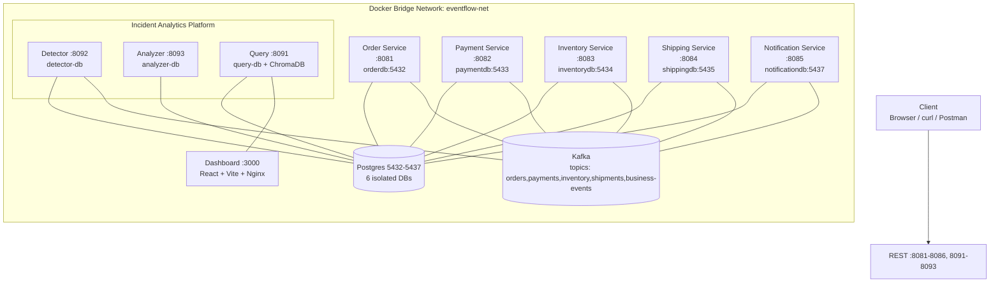
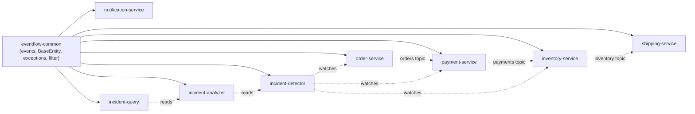
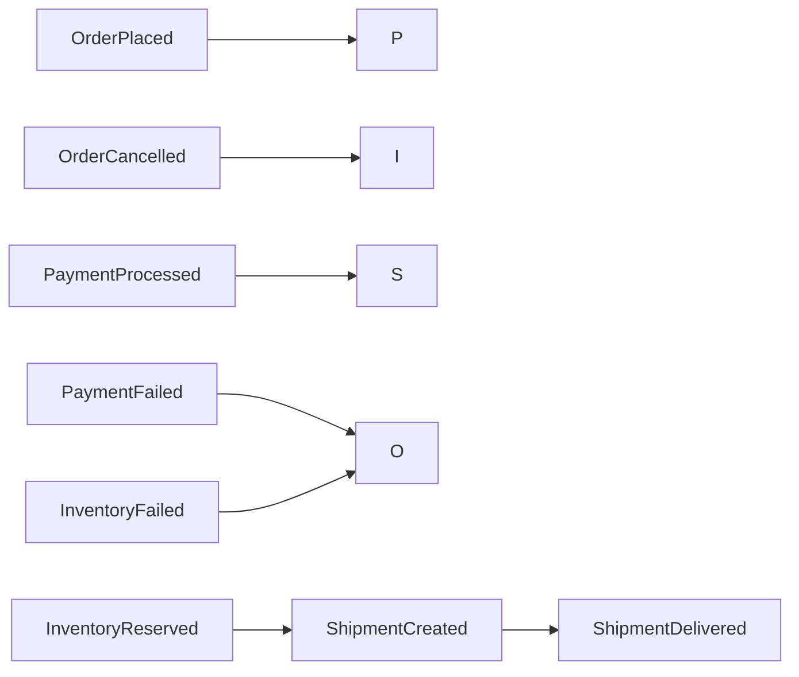
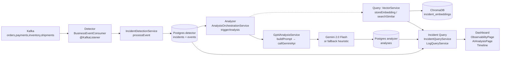
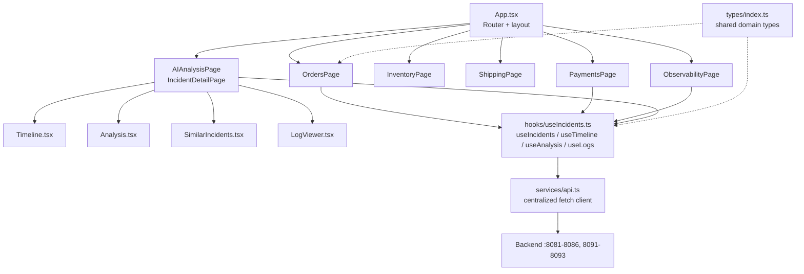
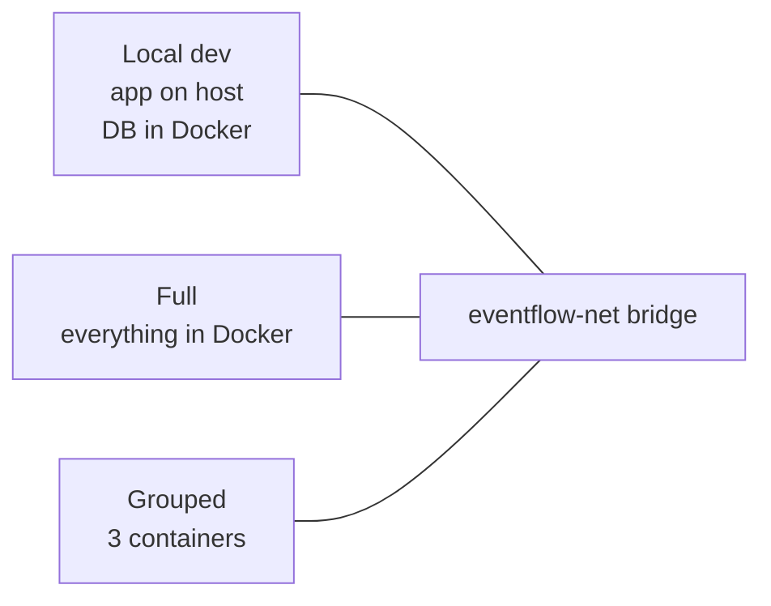
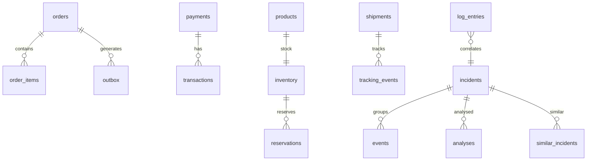
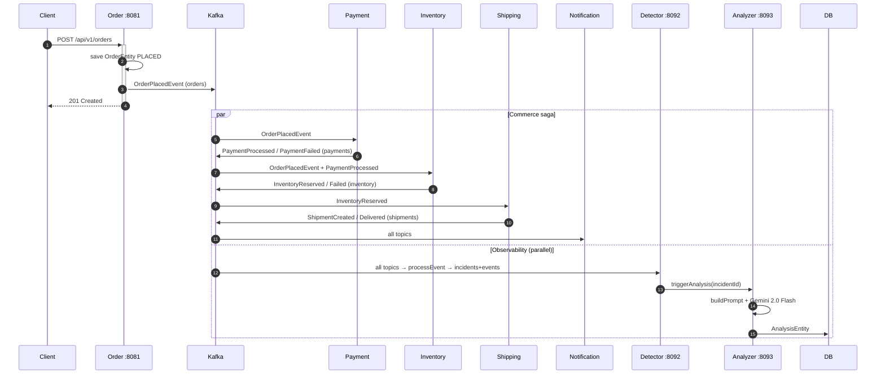

# EventFlow Commerce

> **Production-quality event-driven e-commerce platform** with 8 Spring Boot microservices, AI-powered incident observability, and a React dashboard — built with Java 21, Spring Boot 3.4.4, Apache Kafka, PostgreSQL 16 and Docker.

<p align="center">
  
  
  
  
  
  
</p>

---

## Table of Contents

1. [What is this project?](#1-what-is-this-project)
2. [Tech Stack](#2-tech-stack)
3. [System Architecture](#3-system-architecture)
4. [Services & Ports](#4-services--ports)
5. [Databases](#5-databases)
6. [Event Catalog — Domain Events](#6-event-catalog--domain-events)
7. [Order Lifecycle — Data Flow](#7-order-lifecycle--data-flow)
8. [AI Observability Platform](#8-ai-observability-platform)
9. [Dashboard — Frontend](#9-dashboard--frontend)
10. [Project Structure](#10-project-structure)
11. [Docker Networking & Deployment Modes](#11-docker-networking--deployment-modes)
12. [How to Build & Run](#12-how-to-build--run)
13. [API Reference](#13-api-reference)
14. [Database Design](#14-database-design)
15. [Sequence: Kafka Event Flow](#15-sequence-kafka-event-flow)
16. [Key Design Decisions](#16-key-design-decisions)
17. [Testing](#17-testing)
18. [What is real vs simulated?](#18-what-is-real-vs-simulated)

---

## 1. What is this project?

A **full-stack, event-driven e-commerce backend** plus an **AI incident observability platform** — not a CRUD demo.

- **6 commerce microservices** (Order, Payment, Inventory, Shipping, Notification, + shared library) each owning its own PostgreSQL database.
- **3 incident services** (Detector, Analyzer, Query) that reuse business events as observability alerts — correlated by `correlationId`, classified by severity, analysed with **Gemini 2.0 Flash** and vector search via **ChromaDB**.
- **React dashboard** (Vite + Tailwind) with Orders, Payments, Inventory, Shipping, Observability and AI Analysis pages.
- Clean Architecture + DDD + Flyway migrations + MapStruct + Docker Compose on a single `eventflow-net` bridge network.

This is a **personal portfolio project** demonstrating microservices, saga choreography, and AI-assisted operations.

---

## 2. Tech Stack

| Layer | Technology | Version | Purpose |
|-------|-----------|---------|---------|
| Language | Java | 21 | All backend services |
| Framework | Spring Boot | 3.4.4 | REST + Kafka + JPA |
| Messaging | Apache Kafka | 3.x (KRaft) | Event backbone |
| Databases | PostgreSQL | 16 Alpine | One per service |
| Migrations | Flyway | — | Versioned SQL |
| Mapping | MapStruct | 1.6.3 | Entity ↔ DTO |
| Boilerplate | Lombok | — | — |
| Validation | Spring Validation | — | Request validation |
| API Docs | springdoc-openapi | 2.6.0 | OpenAPI / Swagger |
| Tests | Testcontainers | 1.21.4 | Real Postgres in tests |
| AI | Gemini API | gemini-2.0-flash | Root-cause analysis |
| Vector DB | ChromaDB | — | Incident similarity |
| Frontend | React + TypeScript | Vite + Tailwind | Dashboard |
| Build | Maven | 3.x | Multi-module build |
| Containers | Docker Compose | — | Orchestration |

---

## 3. System Architecture

### 3.1 High-level — all 8 services + Dashboard



### 3.2 Module dependency graph



### 3.3 Clean Architecture — per-service package layout

```
service/
├── domain/                 # Enums, value objects (no Spring dep)
├── entity/                 # JPA entities
├── repository/             # Spring Data JPA
├── dto/request/ & response/# Validated DTOs
├── mapper/                 # MapStruct interfaces
├── service/                # Business logic @Transactional
├── consumer/               # @KafkaListener consumers
├── controller/             # @RestController
└── resources/db/migration/ # Flyway SQL (V1__*.sql)
```

---

## 4. Services & Ports

| # | Service | Port | Docker name | REST prefix | DB name |
|---|---------|------|-------------|-------------|---------|
| 1 | Order Service | 8081 | `order-service` | `/api/v1/orders` | `orderdb` (5432) |
| 2 | Payment Service | 8082 | `payment-service` | `/api/v1/payments` | `paymentdb` (5433) |
| 3 | Inventory Service | 8083 | `inventory-service` | `/api/v1/products`, `/api/v1/inventory` | `inventorydb` (5434) |
| 4 | Shipping Service | 8084 | `shipping-service` | `/api/v1/shipments` | `shippingdb` (5435) |
| 5 | Notification Service | 8085 | `notification-service` | `/api/v1/notifications` | `notificationdb` (5437) |
| 6 | Incident Detector | 8092 | `incident-detector` | `/api/v1/incidents` | `detector-db` |
| 7 | Incident Analyzer | 8093 | `incident-analyzer` | `/api/v1/analyses` | `analyzer-db` |
| 8 | Incident Query | 8091 | `incident-query` | `/api/v1/query`, `/api/v1/logs` | `query-db` + ChromaDB :8000 |
| 9 | Dashboard | 3000 | `dashboard` | — (Nginx) | — |

pgAdmin: `http://localhost:5050` (when started with infra compose)

---

## 5. Databases

Every service **owns** its database — never shared (DDD bounded context). Host ports map 5432-5437 for local access; inside Docker they resolve by service name.

| Container | Host port | DB name | User | Compose file |
|-----------|-----------|---------|------|--------------|
| `eventflow-order-db` | 5432 | orderdb | order_user | `docker/compose.yml` |
| `eventflow-payment-db` | 5433 | paymentdb | payment_user | |
| `eventflow-inventory-db` | 5434 | inventorydb | inventory_user | |
| `eventflow-shipping-db` | 5435 | shippingdb | shipping_user | |
| `eventflow-notification-db` | 5437 | notificationdb | notification_user | |
| `incident-detector-db` | — | detector | — | (included) |
| `incident-analyzer-db` | — | analyzer | — | |
| `incident-query-db` | — | query | — | |
| ChromaDB | 8000 | incident_embeddings | — | |

Persistent volumes: `order-db-data`, `payment-db-data`, `inventory-db-data`, etc.

---

## 6. Event Catalog — Domain Events

All events live in `eventflow-common/src/main/java/com/eventflow/common/event/` as `@SuperBuilder` POJOs extending `BaseEvent`:

```java
BaseEvent { eventId, eventType, correlationId, serviceName, timestamp, severity }
@JsonTypeInfo + @JsonSubTypes // polymorphic deserialization by event_type
```

| Event | File | Triggered by | Consumed by |
|-------|------|-------------|-------------|
| `OrderPlaced` | `OrderPlacedEvent.java` | Order Service | Payment, Inventory, Notification, Detector |
| `OrderCancelled` | `OrderCancelledEvent.java` | Order Service | Inventory, Payment |
| `PaymentProcessed` | `PaymentProcessedEvent.java` | Payment Service | Inventory, Shipping, Notification, Detector |
| `PaymentFailed` | `PaymentFailedEvent.java` | Payment Service | Order, Notification, Detector |
| `InventoryReserved` | `InventoryReservedEvent.java` | Inventory Service | Shipping, Detector |
| `InventoryReleased` | `InventoryReleasedEvent.java` | Inventory Service | Order, Detector |
| `InventoryReservationFailed` | `InventoryReservationFailedEvent.java` | Inventory Service | Order, Detector |
| `ShipmentCreated` | `ShipmentCreatedEvent.java` | Shipping Service | Notification, Detector |
| `ShipmentDelivered` | `ShipmentDeliveredEvent.java` | Shipping Service | Notification, Detector |

Kafka topics: `orders`, `payments`, `inventory`, `shipments`, `business-events`.



---

## 7. Order Lifecycle — Data Flow

### Current (Kafka choreography)

```
Client POST /api/v1/orders → Order Service
  ├─ save OrderEntity (status=PLACED) to orderdb
  └─ publish OrderPlacedEvent(correlationId=orderId) → topic orders

  ┌─ Payment Service (orders) ─ process payment → publish PaymentProcessed/Failed → payments
  ├─ Inventory Service (orders) ─ reserve stock → publish InventoryReserved/Failed → inventory
  └─ Notification Service (orders,payments,inventory,shipments) ─ send notifications

  Payments → Inventory reservation → Shipping creation → ShipmentCreated/Delivered → notifications
```

The incident detector observes **all** topics in parallel — it is not on the critical path.

### If a service is down

Kafka retains events; consumers resume from last offset when the service recovers.

---

## 8. AI Observability Platform

This is the differentiator — it reuses **business events as alerts** rather than separate metrics.

### 8.1 What it captures

- **Every domain event** that carries a `correlationId` (usually `orderId`) — payment failures (gateway timeout 30s), stock shortages, shipment errors, order cancellations.
- **Explicit log ingestion** via `POST /api/v1/logs` → `LogEntryEntity` (ERROR/WARN aggregates).
- Severity normalization inside the detector:
  `INFO/LOW→LOW`, `WARN/MEDIUM→MEDIUM`, `ERROR/HIGH→HIGH`, `FATAL/CRITICAL→CRITICAL` (default MEDIUM).

### 8.2 How it works — 5 stages



**Stage A — Capture** (`incident-detector/consumer/BusinessEventConsumer.java:listen`):
`@KafkaListener(topics={"orders","payments","inventory","shipments"}, groupId="incident-detector-group")` — dual path: typed `BaseEvent` or generic `JsonNode` (snake/camel tolerant). Produces `EventIngestRequest{eventId, eventType, correlationId, serviceName, severity, payload}`.

**Stage B — Correlate** (`IncidentDetectionService.java:processEvent`):
```java
findByCorrelationId(id) ? attach to existing incident : create {OPEN, severity, "OrderPlaced from order-service", affectedServices=[svc]}
save EventEntity → updateIncidentMetadata(lastEventAt, affectedServices)
```
One incident = all events sharing an orderId. A failed payment + failed reservation accumulates under one incident.

**Stage C — AI Analysis** (`AnalysisOrchestrationService.java:triggerAnalysis` + `Gpt4AnalysisService.java`):
Guard `ANALYZING` without `force=true`. Flow: `ANALYZING` → `buildPrompt(incident, eventsSorted, logContext)` → `POST {baseUrl}/v1beta/models/gemini-2.0-flash:generateContent?key=...` (temp 0.3, 2048 tokens) → strip ```json fences → `parseStructuredOutput` → `AnalysisEntity{rootCause, impact, contributingFactors, recommendedActions, preventionMeasures, confidenceScore, modelVersion}` → `ANALYZED` (on error → OPEN). Falls back to **context-aware heuristic** (parses prompt for `PaymentFailed`/`InventoryFailed`/`Shipment`/`HIGH` → dynamic root-cause, impact and confidence 78-87).

**Stage D — Storage**: Detector V1/V2 (incidents, events), Analyzer V3/V6 (analyses), Query V4/V5/V8 (log_entries, similar_incidents). Vectors in ChromaDB.

**Stage E — Query & UI**: `VectorService.searchSimilar(vector, limit, minSimilarity)` → `POST /collections/{incident_embeddings}/query` (cosine). Controllers: `IncidentController`, `LogController`, `SimilarController` → dashboard polling hooks.

---

## 9. Dashboard — Frontend

**Stack:** React + TypeScript + Vite + Tailwind CSS + Nginx



Run locally: `cd dashboard && npm install && npm run dev` (proxies to services) or via Docker on `:3000`.

---

## 10. Project Structure

```
eventflow-commerce/
├── pom.xml                         # Parent POM (dependencyMgt, 9 modules)
├── README.md                       # This file
├── CHANGES.md / INCIDENT_ANALYTICS_ANALYSIS.md
├── .env.example                    # Secrets template
├── docker/
│   ├── compose.yml                 # 9 services + 6 DBs + pgAdmin on eventflow-net
│   ├── compose-infra.yml           # Infra only (DBs + pgAdmin)
│   ├── compose-grouped.yml         # Grouped 3-container deployment
│   ├── Dockerfile.grouped          # Multi-app image
│   └── entrypoint-grouped.sh       # Profile selector + JVM launch
├── eventflow-common/               # Shared JAR
│   └── src/main/java/com/eventflow/common/
│       ├── event/                  # BaseEvent + 9 domain events
│       ├── entity/BaseEntity.java  # id, createdAt, updatedAt, version
│       ├── exception/              # ResourceNotFound, BusinessRuleViolation
│       ├── filter/CorrelationIdFilter.java
│       ├── aspect/LoggingAspect.java
│       ├── handler/GlobalExceptionHandler.java
│       └── config/JacksonConfig.java
├── order-service/        # 8081 — OrderController, OrderService, OrderEntity, OrderRepository
├── payment-service/      # 8082 — PaymentService (simulatePaymentGateway), OrderEventConsumer
├── inventory-service/    # 8083 — InventoryService, PaymentEventConsumer
├── shipping-service/     # 8084 — ShippingService, InventoryEventConsumer
├── notification-service/ # 8085 — NotificationService, BusinessEventConsumer (all topics)
├── incident-detector/    # 8092 — BusinessEventConsumer, IncidentDetectionService
├── incident-analyzer/    # 8093 — AnalysisOrchestrationService, Gpt4AnalysisService, TimelineService
├── incident-query/       # 8091 — LogQueryService, VectorService (ChromaDB), SimilarController
├── dashboard/            # :3000 — React app (pages/, components/, hooks/, services/, types/)
│   ├── src/  vite.config.ts  tailwind.config.js  nginx.conf
└── specs/                # 3 spec slices with contracts, data-model, plan, tasks
    ├── 001-incident-analytics-platform/
    ├── 002-event-driven-commerce-flow/
    └── 003-container-grouping/
```

---

## 11. Docker Networking & Deployment Modes

All containers share one bridge network — Docker DNS resolves service names (no hardcoded IPs).

```yaml
networks:
  eventflow-net:
    driver: bridge
```

Two Spring profiles:

| Profile | Datasource | When |
|---------|-----------|------|
| default (`application.yml`) | `jdbc:postgresql://localhost:5432/orderdb` | Local dev (services on host) |
| docker (`application-docker.yml`) | `jdbc:postgresql://order-db:5432/orderdb` | Inside Docker |
| Dockerfile | `java -jar app.jar --spring.profiles.active=docker` | — |

**Three compose modes:**

| File | What it runs |
|------|--------------|
| `docker/compose.yml` | Full stack: 9 services + 6 Postgres + pgAdmin |
| `docker/compose-infra.yml` | Infra only: 6 Postgres + pgAdmin |
| `docker/compose-grouped.yml` | Grouped: 3 containers (grouped app + infra) |



---

## 12. How to Build & Run

### Prerequisites

- Docker & Docker Compose
- JDK 21 (Temurin) + Maven Wrapper (included)

### Build

```bash
export JAVA_HOME=/path/to/jdk-21
./mvnw clean package -DskipTests
```

### Docker — full stack

```bash
docker compose -f docker/compose.yml build
docker compose -f docker/compose.yml up
docker compose -f docker/compose.yml ps
docker compose -f docker/compose.yml logs -f order-service
docker compose -f docker/compose.yml down
```

### Without Docker (DBs only + run services on host)

```bash
docker compose -f docker/compose.yml up -d order-db payment-db inventory-db shipping-db notification-db
./mvnw spring-boot:run -pl order-service   # repeat per service, profile=default uses localhost
```

### Dashboard alone

```bash
cd dashboard && npm install && npm run dev   # :5173 proxies to services
```

---

## 13. API Reference

### Order Service :8081

| Method | Path | Description |
|--------|------|-------------|
| POST | `/api/v1/orders` | Create order |
| GET | `/api/v1/orders/{id}` | Get by ID |
| GET | `/api/v1/orders?customerId=` | List (paginated) |
| PUT | `/api/v1/orders/{id}/status?status=` | Update status |
| GET | `/health` | Health check |

### Payment Service :8082

| Method | Path | Description |
|--------|------|-------------|
| POST | `/api/v1/payments` | Process payment |
| GET | `/api/v1/payments/{id}` | Get payment |
| GET | `/api/v1/payments/order/{orderId}` | By order |

### Inventory Service :8083

| Method | Path | Description |
|--------|------|-------------|
| POST | `/api/v1/inventory/reserve` | Reserve stock |
| POST | `/api/v1/inventory/release` | Release stock |
| GET | `/api/v1/products/{id}` | Get product |
| POST | `/api/v1/products` | Create product |

### Shipping Service :8084

| Method | Path | Description |
|--------|------|-------------|
| POST | `/api/v1/shipments` | Create shipment |
| GET | `/api/v1/shipments/{id}` | Track |
| PUT | `/api/v1/shipments/{id}/status` | Update status |

### Notification Service :8085

| Method | Path | Description |
|--------|------|-------------|
| POST | `/api/v1/notifications/send` | Send notification |
| GET | `/api/v1/notifications/{id}` | Get status |

### Incident Detector :8092

| Method | Path | Description |
|--------|------|-------------|
| GET | `/api/v1/incidents` | List incidents |
| GET | `/api/v1/incidents/{id}` | Get incident |
| POST | `/api/v1/incidents` | Create manually |
| PUT | `/api/v1/incidents/{id}` | Update |

### Incident Analyzer :8093

| Method | Path | Description |
|--------|------|-------------|
| POST | `/api/v1/analyses/{incidentId}` | Trigger AI analysis |
| GET | `/api/v1/analyses/{incidentId}` | Get analysis |
| GET | `/api/v1/timeline/{incidentId}` | Event timeline |

### Incident Query :8091

| Method | Path | Description |
|--------|------|-------------|
| GET | `/api/v1/query/incidents` | Query incidents |
| POST | `/api/v1/logs` | Ingest log |
| GET | `/api/v1/logs` | Query logs |
| GET | `/api/v1/logs/stats` | Error aggregates |
| POST | `/api/v1/similar` | Similar incidents (vector) |
| GET | `/health` | Health |

All success responses wrap in `ApiResponse{success, data, timestamp}`; errors in `ErrorResponse{success, error, message, status, timestamp}`.

---

## 14. Database Design



| Service | Key tables | Notable columns |
|---------|-----------|-----------------|
| Order | `orders`, `outbox`, `order_items` | `status(PENDING/CONFIRMED/CANCELLED/SHIPPED)`, `payload JSONB` |
| Payment | `payments`, `transactions` | `status(PENDING/COMPLETED/FAILED/REFUNDED)` |
| Inventory | `products`, `inventory`, `reservations` | `quantity_available/reserved`, `version` (optimistic lock) |
| Shipping | `shipments`, `tracking_events` | `tracking_number`, `estimated_delivery` |
| Notification | `notifications`, `notification_recipient` | `type(EMAIL/PUSH/SMS)` |
| Detector | `incidents`, `events` | `correlationId UNIQUE`, `severity`, `status(OPEN/ANALYZING/ANALYZED)` |
| Analyzer | `analyses`, `incidents`, `events` | `confidence_score`, `model_version` |
| Query | `log_entries`, `similar_incidents` | ChromaDB vectors externally |

All entities extend `BaseEntity{id UUID, createdAt, updatedAt, version, active}`.

---

## 15. Sequence: Kafka Event Flow



---

## 16. Key Design Decisions

**Database per service** — Each service owns its Postgres; no cross-DB joins. Trade-off: eventual consistency over strong consistency.

**Event choreography over orchestration** — No central saga orchestrator; each service reacts to events it cares about. Simpler, more decoupled.

**Transactional Outbox (all publishing services)** — Order, Payment, Inventory and Shipping save `outbox_events(PENDING)` in the same `@Transactional` as the domain write; `OutboxPublisher` (`@Scheduled fixedDelay=5000`) publishes `PENDING` rows to Kafka and marks them `PUBLISHED`. `eventflow-common` provides `OutboxEntity`, `OutboxRepository`, `OutboxService` and `OutboxPublisher`. Guarantees at-least-once delivery.

**Polymorphic events** — `@JsonTypeInfo + @JsonSubTypes` on `BaseEvent` lets one Kafka topic carry multiple event types with type-safe deserialization.

**Severity normalization** — Detector maps string severities to enum; fallback MEDIUM keeps pipeline robust to new producers.

**Fallback analysis** — Analyzer returns **context-aware** heuristic JSON (inspects prompt for `PaymentFailed`/`InventoryFailed`/`Shipment`/`HIGH`) with dynamic root-cause and confidence 78-87 when Gemini is unavailable.

**CorrelationId as incident key** — One incident per `orderId`; all related failures aggregate under one view (timeline + affectedServices).

---

## 17. Testing

```bash
./mvnw clean test
./mvnw clean test -pl order-service
```

Stack: JUnit 5 + Testcontainers (real Postgres) + Spring Boot test slices. Covers repositories, services, controllers and Kafka consumers.

---

## 18. What is real vs simulated?

| Area | Status |
|------|--------|
| Kafka messaging, Postgres per service, Flyway, MapStruct, Docker | Real |
| Payment gateway | Simulated (`simulatePaymentGateway`) — no external provider |
| Transactional Outbox table | Implemented in Order, Payment, Inventory, Shipping via `eventflow-common` (`OutboxEntity`, `OutboxPublisher` @Scheduled 5s); direct `kafkaTemplate.send` only inside publisher |
| Gemini analysis | Real API when `GEMINI_API_KEY` set; otherwise context-aware heuristic (dynamic root-cause by event type, confidence 78-87) |
| Vector embeddings | Real `embedText(text, 384)` TF-hash + L2 normalization and `cosineSimilarity(a,b)` in `VectorService`; ChromaDB stores/queries via `double[]` — swap with OpenAI/Gemini embeddings for production quality |
| Auth / JWT / rate limiting / Prometheus | Not implemented |

> Label this as a **personal portfolio project** — demonstrates architecture, not an employer production system.

---

*EventFlow Commerce — 2026. Built to learn event-driven architecture and AI-assisted operations.*
