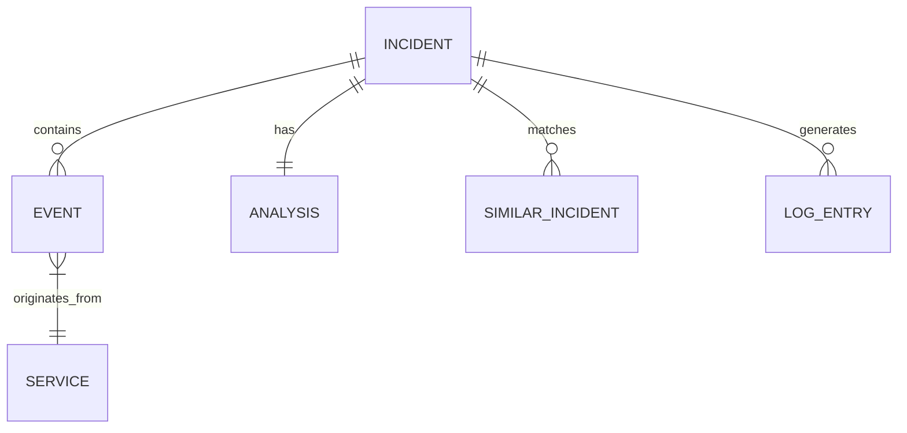

# Data Model: Incident Analytics Platform

**Feature**: 001-incident-analytics-platform
**Date**: 2026-08-15

## Entity Relationship Diagram



## PostgreSQL Schema (Relational Data)

### Table: incidents
Stores incident metadata and status.

| Column | Type | Constraints | Description |
|--------|------|-------------|-------------|
| id | UUID | PRIMARY KEY, DEFAULT gen_random_uuid() | Unique incident identifier |
| correlation_id | VARCHAR(255) | NOT NULL, INDEX | Correlation ID from Kafka events |
| status | VARCHAR(50) | NOT NULL, DEFAULT 'OPEN' | OPEN, ANALYZING, ANALYZED, RESOLVED |
| severity | VARCHAR(20) | NOT NULL | LOW, MEDIUM, HIGH, CRITICAL |
| title | VARCHAR(500) | NOT NULL | Human-readable incident title |
| description | TEXT | | Detailed description |
| affected_services | JSONB | NOT NULL, DEFAULT '[]' | Array of service names |
| duration_seconds | INTEGER | | Total incident duration |
| first_event_at | TIMESTAMPTZ | NOT NULL | Timestamp of first event |
| last_event_at | TIMESTAMPTZ | | Timestamp of last event |
| created_at | TIMESTAMPTZ | NOT NULL, DEFAULT NOW() | Record creation time |
| updated_at | TIMESTAMPTZ | NOT NULL, DEFAULT NOW() | Last update time |
| chroma_collection_id | VARCHAR(255) | | Reference to ChromaDB collection |

**Indexes**:
- `idx_incidents_correlation_id` ON correlation_id
- `idx_incidents_status` ON status
- `idx_incidents_severity` ON severity
- `idx_incidents_created_at` ON created_at DESC

### Table: events
Stores all Kafka business events for timeline reconstruction.

| Column | Type | Constraints | Description |
|--------|------|-------------|-------------|
| id | UUID | PRIMARY KEY, DEFAULT gen_random_uuid() | Unique event identifier |
| incident_id | UUID | FOREIGN KEY REFERENCES incidents(id) ON DELETE CASCADE | Parent incident |
| event_id | VARCHAR(255) | NOT NULL, UNIQUE | Original Kafka event ID |
| correlation_id | VARCHAR(255) | NOT NULL, INDEX | Correlation ID |
| event_type | VARCHAR(100) | NOT NULL | OrderPlaced, PaymentFailed, etc. |
| service_name | VARCHAR(100) | NOT NULL, INDEX | Originating service |
| timestamp | TIMESTAMPTZ | NOT NULL, INDEX | Event occurrence time |
| payload | JSONB | NOT NULL | Full event payload |
| severity | VARCHAR(20) | NOT NULL | LOW, MEDIUM, HIGH, CRITICAL |
| created_at | TIMESTAMPTZ | NOT NULL, DEFAULT NOW() | Ingestion time |

**Indexes**:
- `idx_events_incident_id` ON incident_id
- `idx_events_correlation_id` ON correlation_id
- `idx_events_service_name` ON service_name
- `idx_events_timestamp` ON timestamp DESC

### Table: analyses
Stores AI-generated root cause analysis results.

| Column | Type | Constraints | Description |
|--------|------|-------------|-------------|
| id | UUID | PRIMARY KEY, DEFAULT gen_random_uuid() | Unique analysis identifier |
| incident_id | UUID | NOT NULL, FOREIGN KEY REFERENCES incidents(id) ON DELETE CASCADE, UNIQUE | Parent incident |
| root_cause | TEXT | NOT NULL | Identified root cause |
| impact | TEXT | NOT NULL | Impact assessment |
| contributing_factors | JSONB | NOT NULL, DEFAULT '[]' | Array of contributing factors |
| recommended_actions | JSONB | NOT NULL, DEFAULT '[]' | Array of recommended actions |
| prevention_measures | JSONB | NOT NULL, DEFAULT '[]' | Array of prevention measures |
| confidence_score | INTEGER | NOT NULL, CHECK (confidence_score >= 0 AND confidence_score <= 100) | Confidence 0-100 |
| model_version | VARCHAR(100) | NOT NULL | GPT-4 model used |
| prompt_tokens | INTEGER | | Tokens used in prompt |
| completion_tokens | INTEGER | | Tokens in response |
| created_at | TIMESTAMPTZ | NOT NULL, DEFAULT NOW() | Analysis generation time |

### Table: log_entries
Centralized structured logs from all services.

| Column | Type | Constraints | Description |
|--------|------|-------------|-------------|
| id | UUID | PRIMARY KEY, DEFAULT gen_random_uuid() | Unique log identifier |
| correlation_id | VARCHAR(255) | NOT NULL, INDEX | Correlation ID for filtering |
| service_name | VARCHAR(100) | NOT NULL, INDEX | Originating service |
| timestamp | TIMESTAMPTZ | NOT NULL, INDEX | Log timestamp |
| level | VARCHAR(20) | NOT NULL, INDEX | DEBUG, INFO, WARN, ERROR, CRITICAL |
| message | TEXT | NOT NULL | Log message |
| metadata | JSONB | DEFAULT '{}' | Additional structured fields |
| trace_id | VARCHAR(255) | | Distributed trace ID |
| span_id | VARCHAR(255) | | Span ID for tracing |
| created_at | TIMESTAMPTZ | NOT NULL, DEFAULT NOW() | Ingestion time |

**Indexes**:
- `idx_logs_correlation_id` ON correlation_id
- `idx_logs_service_name` ON service_name
- `idx_logs_timestamp` ON timestamp DESC
- `idx_logs_level` ON level
- `idx_logs_trace_id` ON trace_id

### Table: similar_incidents
Pre-computed or cached similar incident relationships.

| Column | Type | Constraints | Description |
|--------|------|-------------|-------------|
| id | UUID | PRIMARY KEY, DEFAULT gen_random_uuid() | Unique identifier |
| incident_id | UUID | NOT NULL, FOREIGN KEY REFERENCES incidents(id) ON DELETE CASCADE | Source incident |
| similar_incident_id | UUID | NOT NULL, FOREIGN KEY REFERENCES incidents(id) ON DELETE CASCADE | Similar incident |
| similarity_score | REAL | NOT NULL, CHECK (similarity_score >= 0 AND similarity_score <= 1) | Cosine similarity 0-1 |
| matched_on | VARCHAR(100) | NOT NULL | embedding, timeline, error_pattern |
| created_at | TIMESTAMPTZ | NOT NULL, DEFAULT NOW() | Computation time |

**Indexes**:
- `idx_similar_incident_id` ON incident_id
- `idx_similar_similar_incident_id` ON similar_incident_id
- `idx_similar_score` ON similarity_score DESC

## ChromaDB Collections (Vector Data)

### Collection: incident_embeddings
Stores vector embeddings for similarity search.

**Metadata Fields**:
| Field | Type | Description |
|-------|------|-------------|
| incident_id | string | UUID of incident |
| correlation_id | string | Correlation ID |
| event_types | string | Comma-separated event types |
| severity | string | Incident severity |
| created_at | string | ISO timestamp |

**Embedding**: 1536-dimensional vector from text-embedding-3-small

**Document Text**: Concatenated string for embedding:
```
Incident: {title}
Events: {event_type_1}, {event_type_2}, ...
Services: {service_1}, {service_2}, ...
Root Cause: {root_cause or 'pending'}
```

## Kafka Event Schemas

### Common Event Structure
All events share this base structure:

```json
{
  "event_id": "uuid",
  "event_type": "string",
  "correlation_id": "string",
  "service_name": "string",
  "timestamp": "ISO8601",
  "severity": "LOW|MEDIUM|HIGH|CRITICAL",
  "payload": {}
}
```

### Event Types

#### OrderPlaced
```json
{
  "event_type": "OrderPlaced",
  "payload": {
    "order_id": "string",
    "customer_id": "string",
    "items": [{"product_id": "string", "quantity": "integer", "price": "number"}],
    "total_amount": "number"
  }
}
```

#### PaymentFailed
```json
{
  "event_type": "PaymentFailed",
  "payload": {
    "order_id": "string",
    "payment_id": "string",
    "failure_reason": "INSUFFICIENT_FUNDS|CARD_DECLINED|EXPIRED_CARD|PROCESSING_ERROR",
    "amount": "number",
    "currency": "string"
  }
}
```

#### InventoryReleased
```json
{
  "event_type": "InventoryReleased",
  "payload": {
    "order_id": "string",
    "items": [{"product_id": "string", "quantity": "integer", "reason": "PAYMENT_FAILED|ORDER_CANCELLED"}]
  }
}
```

#### OrderCancelled
```json
{
  "event_type": "OrderCancelled",
  "payload": {
    "order_id": "string",
    "reason": "PAYMENT_FAILED|CUSTOMER_REQUEST|INVENTORY_UNAVAILABLE",
    "cancelled_by": "SYSTEM|CUSTOMER|SUPPORT"
  }
}
```

#### ShipmentCreated
```json
{
  "event_type": "ShipmentCreated",
  "payload": {
    "order_id": "string",
    "shipment_id": "string",
    "carrier": "string",
    "tracking_number": "string",
    "items": [{"product_id": "string", "quantity": "integer"}]
  }
}
```

#### ShipmentDelivered
```json
{
  "event_type": "ShipmentDelivered",
  "payload": {
    "shipment_id": "string",
    "delivered_at": "ISO8601",
    "signed_by": "string"
  }
}
```

## Java JPA Entities & DTOs (Spring Boot)

*All entities extend `BaseEntity` from `eventflow-common` (provides id, createdAt, updatedAt, version, active). Uses Lombok + MapStruct following EventFlow Commerce patterns.*

### Enums (domain layer)
```java
// com.eventflow.incidentdetector.domain
public enum IncidentStatus {
    OPEN, ANALYZING, ANALYZED, RESOLVED
}

public enum Severity {
    LOW, MEDIUM, HIGH, CRITICAL
}

public enum LogLevel {
    DEBUG, INFO, WARN, ERROR, CRITICAL
}
```

### Entity: IncidentEntity
```java
// com.eventflow.incidentdetector.entity
@Entity
@Table(name = "incidents")
@Data
@Builder
@NoArgsConstructor
@AllArgsConstructor
public class IncidentEntity extends BaseEntity {

    @Column(nullable = false, unique = true)
    private String correlationId;

    @Enumerated(EnumType.STRING)
    @Column(nullable = false)
    private IncidentStatus status;

    @Enumerated(EnumType.STRING)
    @Column(nullable = false)
    private Severity severity;

    @Column(nullable = false, length = 500)
    private String title;

    @Column(columnDefinition = "TEXT")
    private String description;

    @Column(columnDefinition = "jsonb")
    private List<String> affectedServices;

    private Integer durationSeconds;

    @Column(nullable = false)
    private Instant firstEventAt;

    private Instant lastEventAt;

    private String chromaCollectionId;
}
```

### Entity: EventEntity
```java
// com.eventflow.incidentdetector.entity
@Entity
@Table(name = "events")
@Data
@Builder
@NoArgsConstructor
@AllArgsConstructor
public class EventEntity extends BaseEntity {

    @ManyToOne(fetch = FetchType.LAZY)
    @JoinColumn(name = "incident_id", nullable = false)
    private IncidentEntity incident;

    @Column(nullable = false, unique = true)
    private String eventId;

    @Column(nullable = false)
    private String correlationId;

    @Column(nullable = false)
    private String eventType;

    @Column(nullable = false)
    private String serviceName;

    @Column(nullable = false)
    private Instant timestamp;

    @Column(nullable = false, columnDefinition = "jsonb")
    private Map<String, Object> payload;

    @Enumerated(EnumType.STRING)
    @Column(nullable = false)
    private Severity severity;
}
```

### Entity: AnalysisEntity
```java
// com.eventflow.incidentanalyzer.entity
@Entity
@Table(name = "analyses")
@Data
@Builder
@NoArgsConstructor
@AllArgsConstructor
public class AnalysisEntity extends BaseEntity {

    @OneToOne(fetch = FetchType.LAZY)
    @JoinColumn(name = "incident_id", nullable = false, unique = true)
    private IncidentEntity incident;

    @Column(nullable = false, columnDefinition = "TEXT")
    private String rootCause;

    @Column(nullable = false, columnDefinition = "TEXT")
    private String impact;

    @Column(nullable = false, columnDefinition = "jsonb")
    private List<String> contributingFactors;

    @Column(nullable = false, columnDefinition = "jsonb")
    private List<String> recommendedActions;

    @Column(nullable = false, columnDefinition = "jsonb")
    private List<String> preventionMeasures;

    @Column(nullable = false)
    private Integer confidenceScore;

    @Column(nullable = false)
    private String modelVersion;

    private Integer promptTokens;
    private Integer completionTokens;
}
```

### Entity: LogEntryEntity
```java
// com.eventflow.incidentquery.entity
@Entity
@Table(name = "log_entries")
@Data
@Builder
@NoArgsConstructor
@AllArgsConstructor
public class LogEntryEntity extends BaseEntity {

    @Column(nullable = false)
    private String correlationId;

    @Column(nullable = false)
    private String serviceName;

    @Column(nullable = false)
    private Instant timestamp;

    @Enumerated(EnumType.STRING)
    @Column(nullable = false)
    private LogLevel level;

    @Column(nullable = false, columnDefinition = "TEXT")
    private String message;

    @Column(columnDefinition = "jsonb")
    private Map<String, Object> metadata;

    private String traceId;
    private String spanId;
}
```

### Entity: SimilarIncidentEntity
```java
// com.eventflow.incidentquery.entity
@Entity
@Table(name = "similar_incidents")
@Data
@Builder
@NoArgsConstructor
@AllArgsConstructor
public class SimilarIncidentEntity extends BaseEntity {

    @ManyToOne(fetch = FetchType.LAZY)
    @JoinColumn(name = "incident_id", nullable = false)
    private IncidentEntity incident;

    @ManyToOne(fetch = FetchType.LAZY)
    @JoinColumn(name = "similar_incident_id", nullable = false)
    private IncidentEntity similarIncident;

    @Column(nullable = false)
    private Float similarityScore;

    @Column(nullable = false)
    private String matchedOn;
}
```

### MapStruct Mappers
```java
// com.eventflow.incidentdetector.mapper.IncidentMapper
@Mapper(componentModel = "spring")
public interface IncidentMapper {
    IncidentResponse toResponse(IncidentEntity entity);
    List<IncidentResponse> toResponseList(List<IncidentEntity> entities);
}

// com.eventflow.incidentanalyzer.mapper.AnalysisMapper
@Mapper(componentModel = "spring")
public interface AnalysisMapper {
    AnalysisResponse toResponse(AnalysisEntity entity);
}

// com.eventflow.incidentquery.mapper.LogMapper
@Mapper(componentModel = "spring")
public interface LogMapper {
    LogEntryResponse toResponse(LogEntryEntity entity);
    List<LogEntryResponse> toResponseList(List<LogEntryEntity> entities);
}
```

### Response DTOs (Java Records — map from entities via MapStruct)
```java
// com.eventflow.common.dto (shared) or service-specific dto/response/
public record IncidentResponse(
    UUID id,
    String correlationId,
    IncidentStatus status,
    Severity severity,
    String title,
    String description,
    List<String> affectedServices,
    Integer durationSeconds,
    Instant firstEventAt,
    Instant lastEventAt,
    Instant createdAt,
    Instant updatedAt
) {}

public record TimelineResponse(
    UUID incidentId,
    List<EventResponse> events,
    int totalDurationSeconds,
    int eventCount,
    List<String> affectedServices
) {}

public record EventResponse(
    String eventId,
    String eventType,
    String serviceName,
    Instant timestamp,
    Map<String, Object> payload,
    Severity severity
) {}

public record AnalysisResponse(
    UUID id,
    UUID incidentId,
    String rootCause,
    String impact,
    List<String> contributingFactors,
    List<String> recommendedActions,
    List<String> preventionMeasures,
    int confidenceScore,
    String modelVersion,
    Integer promptTokens,
    Integer completionTokens,
    Instant createdAt
) {}

public record LogEntryResponse(
    UUID id,
    String correlationId,
    String serviceName,
    Instant timestamp,
    LogLevel level,
    String message,
    Map<String, Object> metadata,
    String traceId,
    String spanId
) {}

public record SimilarIncidentResponse(
    UUID incidentId,
    String correlationId,
    String title,
    Severity severity,
    IncidentStatus status,
    float similarityScore,
    String matchedOn,
    String rootCauseSummary
) {}

public record LogStatsResponse(
    Instant startTime,
    Instant endTime,
    List<ServiceErrorStats> services
) {}

public record ServiceErrorStats(
    String serviceName,
    int errorCount,
    int criticalCount,
    List<TopError> topErrors
) {}

public record TopError(String message, int count) {}
```

## State Transitions

### Incident Status Flow
```
OPEN → ANALYZING → ANALYZED → RESOLVED
  ↘                    ↗
   └──────────────────┘ (can reopen if needed)
```

### Analysis Trigger
- Manual: User clicks "Analyze" in dashboard
- Automatic: Configurable (e.g., HIGH/CRITICAL severity auto-triggers)

## Validation Rules

1. **Incident**: correlation_id must be unique per incident (enforced by grouping logic)
2. **Event**: event_id must be globally unique (Kafka guarantee)
3. **Analysis**: One analysis per incident (enforced by UNIQUE constraint on incident_id)
4. **LogEntry**: correlation_id + service_name + timestamp should be unique per log line
5. **SimilarIncident**: incident_id != similar_incident_id (no self-similarity)

## Retention Policy

| Data | Active Retention | Archive Strategy |
|------|------------------|------------------|
| Incidents | 90 days | Move to cold storage (S3/Glacier) |
| Events | 90 days | Move to cold storage |
| Analyses | 90 days | Move to cold storage |
| Log Entries | 30 days | Move to cold storage |
| Vector Embeddings | 90 days | Delete from ChromaDB, keep metadata in PostgreSQL |
| Similar Incidents | 90 days | Recompute on demand from archived data |